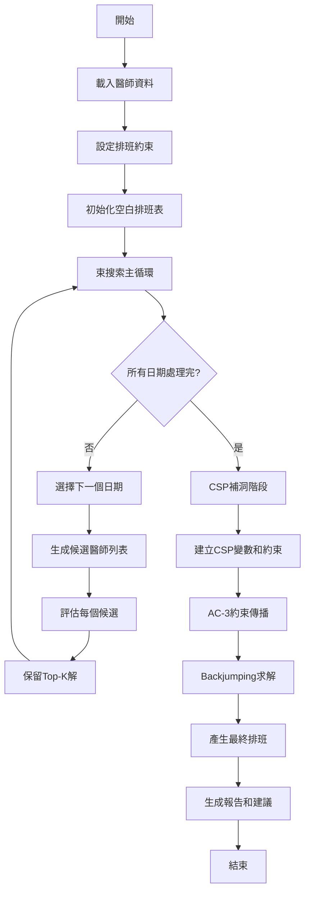
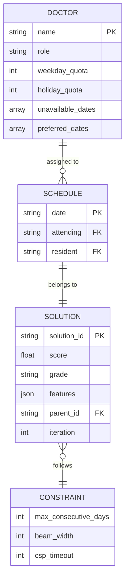
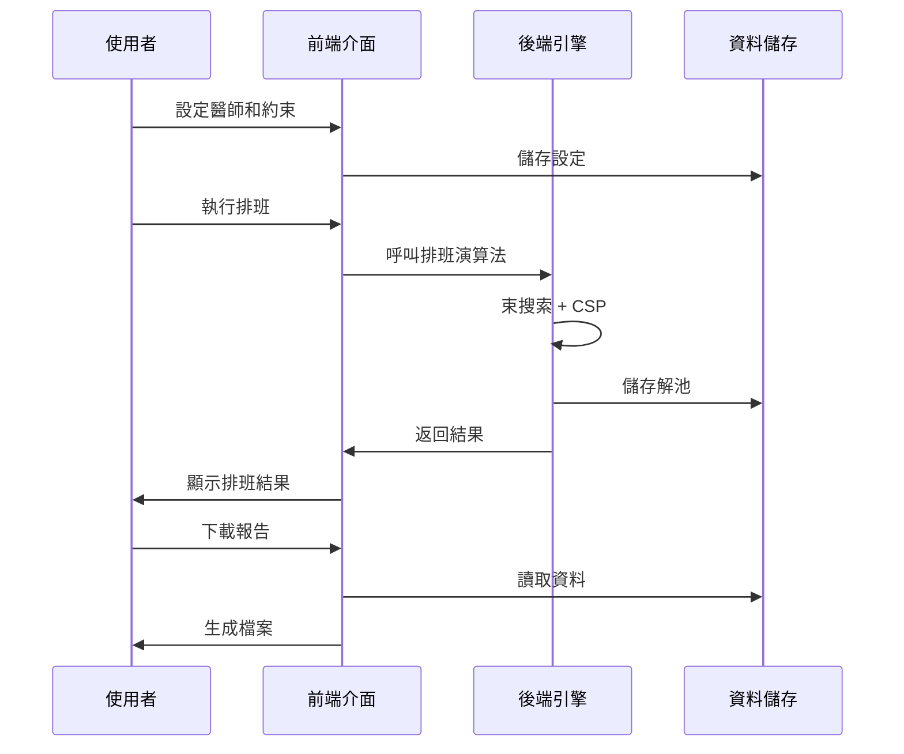

# 醫師智慧排班系統 - 專案架構文件

## 📋 目錄

- [專案概述](#專案概述)
- [系統架構](#系統架構)
- [技術棧](#技術棧)
- [核心模組詳解](#核心模組詳解)
- [演算法設計](#演算法設計)
- [資料模型](#資料模型)
- [API 與介面設計](#api-與介面設計)
- [機器學習整合](#機器學習整合)
- [部署與維護](#部署與維護)
- [開發指南](#開發指南)

---

## 專案概述

### 🎯 專案目標

醫師智慧排班系統是一個結合傳統演算法與機器學習的智慧排班解決方案，專為醫院設計，用於自動化處理主治醫師與住院醫師的月度排班工作。

### 💡 核心價值

1. **自動化排班**：減少人工排班時間從數小時降至分鐘級
2. **公平性保證**：透過演算法確保值班分配的公平性
3. **彈性約束**：支援複雜的排班規則和個人偏好
4. **智慧優化**：使用 AI 技術持續改進排班品質
5. **資料驅動**：收集排班資料用於機器學習訓練

### 🏥 應用場景

- 醫院急診部門排班
- 住院醫師訓練排程
- 主治醫師值班安排
- 跨科室協調排班

---

## 系統架構

### 🏗️ 整體架構圖

```
┌─────────────────────────────────────────────────────────────┐
│                        使用者介面層                           │
│  ┌─────────────────────────────────────────────────────┐   │
│  │            Streamlit Web Application                 │   │
│  │  ┌──────┐ ┌──────┐ ┌──────┐ ┌──────┐ ┌──────┐    │   │
│  │  │醫師  │ │假日  │ │排班  │ │結果  │ │ ML   │    │   │
│  │  │管理  │ │設定  │ │執行  │ │檢視  │ │分析  │    │   │
│  │  └──────┘ └──────┘ └──────┘ └──────┘ └──────┘    │   │
│  └─────────────────────────────────────────────────────┘   │
└─────────────────────────────────────────────────────────────┘
                              │
                              ▼
┌─────────────────────────────────────────────────────────────┐
│                         前端服務層                           │
│  ┌──────────────┐  ┌──────────────┐  ┌──────────────┐    │
│  │   Pages      │  │  Components  │  │    Utils     │    │
│  │  (頁面模組)   │  │   (UI組件)    │  │   (工具函數)  │    │
│  └──────────────┘  └──────────────┘  └──────────────┘    │
└─────────────────────────────────────────────────────────────┘
                              │
                              ▼
┌─────────────────────────────────────────────────────────────┐
│                         業務邏輯層                           │
│  ┌──────────────┐  ┌──────────────┐  ┌──────────────┐    │
│  │  Algorithms  │  │  Analyzers   │  │      ML      │    │
│  │   (演算法)    │  │   (分析器)    │  │  (機器學習)   │    │
│  └──────────────┘  └──────────────┘  └──────────────┘    │
└─────────────────────────────────────────────────────────────┘
                              │
                              ▼
┌─────────────────────────────────────────────────────────────┐
│                         資料存取層                           │
│  ┌──────────────┐  ┌──────────────┐  ┌──────────────┐    │
│  │    Models    │  │     Utils    │  │   Storage    │    │
│  │  (資料模型)   │  │   (工具函數)  │  │   (檔案儲存)  │    │
│  └──────────────┘  └──────────────┘  └──────────────┘    │
└─────────────────────────────────────────────────────────────┘
```

### 📁 目錄結構

```
hospital_scheduling/
│
├── main.py                          # 應用程式入口點
├── requirements.txt                 # Python 套件依賴
├── config.yaml                     # 系統配置檔
│
├── frontend/                        # 前端模組
│   ├── pages/                      # 頁面模組
│   │   ├── doctor_management.py    # 醫師管理
│   │   ├── calendar_settings.py    # 假日設定
│   │   ├── schedule_execution.py   # 排班執行
│   │   ├── schedule_viewer.py      # 結果檢視
│   │   ├── statistics_analysis.py  # 統計分析
│   │   └── ml_analytics.py         # ML分析
│   │
│   ├── components/                  # UI組件
│   │   ├── calendar_view.py        # 月曆視圖
│   │   └── schedule_table.py       # 排班表格
│   │
│   └── utils/                       # 前端工具
│       ├── styles.py               # CSS樣式
│       └── session_manager.py      # Session管理
│
├── backend/                         # 後端模組
│   ├── models/                      # 資料模型
│   │   ├── doctor.py               # 醫師模型
│   │   ├── schedule.py             # 排班模型
│   │   └── solution.py             # 解決方案模型
│   │
│   ├── algorithms/                  # 核心演算法
│   │   ├── beam_search.py          # 束搜索
│   │   ├── csp_solver.py           # CSP求解器
│   │   └── heuristics.py           # 啟發式方法
│   │
│   ├── analyzers/                   # 分析模組
│   │   ├── schedule_scorer.py      # 排班評分
│   │   ├── feature_extractor.py    # 特徵提取
│   │   ├── solution_grader.py      # 解分級
│   │   └── complexity_analyzer.py  # 複雜度分析
│   │
│   ├── ml/                          # 機器學習
│   │   ├── solution_pool.py        # 解池管理
│   │   └── training_generator.py   # 訓練資料生成
│   │
│   └── utils/                       # 後端工具
│       ├── calendar_utils.py       # 月曆工具
│       └── validation.py           # 資料驗證
│
└── data/                            # 資料儲存
    ├── configs/                     # 配置檔案
    ├── schedules/                   # 排班結果
    └── training_data/               # ML訓練資料
```

---

## 技術棧

### 🛠️ 核心技術

| 類別 | 技術 | 版本 | 用途 |
|------|------|------|------|
| **程式語言** | Python | 3.8+ | 主要開發語言 |
| **Web框架** | Streamlit | 1.28+ | Web應用開發 |
| **資料處理** | Pandas | 2.0+ | 資料操作與分析 |
| **數值計算** | NumPy | 1.24+ | 數值運算 |
| **視覺化** | Plotly | 5.14+ | 互動式圖表 |
| **日期處理** | datetime/calendar | 內建 | 日期時間操作 |

### 🔧 演算法技術

| 演算法 | 用途 | 特點 |
|--------|------|------|
| **Beam Search** | 主要排班演算法 | 平衡探索與效率 |
| **CSP with AC-3** | 約束滿足 | 提前偵測無解 |
| **Conflict-Directed Backjumping** | 智慧回溯 | 避免無謂搜索 |
| **Forward Checking** | 前向檢查 | 動態縮減搜索空間 |
| **MRV Heuristic** | 變數選擇 | 優先處理困難變數 |
| **LCV Heuristic** | 值排序 | 最小化約束影響 |

### 📊 資料結構

- **Dataclass**: 類型安全的資料模型
- **Dictionary**: 快速查找排班資訊
- **List/Set**: 管理日期和醫師集合
- **DataFrame**: 結構化資料分析

---

## 核心模組詳解

### 1. 資料模型層 (`backend/models/`)

#### Doctor 模型
```python
@dataclass
class Doctor:
    name: str                    # 醫師姓名
    role: Literal["主治", "總醫師"]  # 角色類型
    weekday_quota: int           # 平日配額
    holiday_quota: int           # 假日配額
    unavailable_dates: List[str] # 不可值班日
    preferred_dates: List[str]   # 偏好值班日
```

**設計理念**：
- 使用 `@dataclass` 提供自動生成的建構函數和比較方法
- 支援序列化/反序列化用於資料持久化
- 彈性的約束定義支援個人化需求

#### ScheduleSlot 模型
```python
@dataclass
class ScheduleSlot:
    date: str                    # 日期
    attending: Optional[str]     # 主治醫師
    resident: Optional[str]      # 住院醫師
```

**設計理念**：
- 簡潔的資料結構代表單日排班
- Optional 類型支援未填格的情況
- 易於擴展額外的排班資訊

### 2. 演算法層 (`backend/algorithms/`)

#### Beam Search 束搜索

**核心概念**：
- 在每個決策點保留 K 個最佳候選解
- 平衡搜索的廣度和深度
- 適合處理大規模組合優化問題

**實作特點**：
```python
class BeamSearchScheduler:
    def __init__(self, beam_width=5):
        self.beam_width = beam_width  # 束寬度
        
    def run(self):
        beam = [(initial_score, initial_schedule)]
        for date in all_dates:
            new_beam = []
            for score, schedule in beam:
                # 展開所有可能的醫師選擇
                for doctor in available_doctors:
                    new_schedule = assign(schedule, date, doctor)
                    new_score = evaluate(new_schedule)
                    new_beam.append((new_score, new_schedule))
            # 保留Top-K
            beam = sorted(new_beam)[:self.beam_width]
```

#### CSP 約束滿足問題求解器

**核心技術**：

1. **Arc Consistency (AC-3)**
   - 通過約束傳播減少變數域
   - 提前檢測不可行解
   - 時間複雜度：O(ed³)，e為約束數，d為域大小

2. **Conflict-Directed Backjumping**
   - 記錄衝突集合
   - 直接跳回衝突源頭
   - 避免系統性的無效搜索

3. **Forward Checking**
   - 每次賦值後更新相關變數的域
   - 及時發現死路
   - 大幅減少回溯次數

### 3. 分析層 (`backend/analyzers/`)

#### 排班評分器

**評分公式**：
```
Score = -1000 × 未填格數
        -100 × 硬違規數
        -10 × 軟違規數
        +5 × 公平性指標
        +2 × 偏好滿足數
```

**設計理念**：
- 權重反映不同因素的重要性
- 負分懲罰違規，正分獎勵優化
- 可調整權重適應不同需求

#### 特徵提取器

**提取的特徵類別**：

1. **基礎統計特徵**
   - 填充率、未填格數
   - 總格位數、已填格位數

2. **違規特徵**
   - 硬違規（不可值班日、超額）
   - 軟違規（連續值班）
   - 約束違反詳情

3. **公平性特徵**
   - 值班次數標準差
   - Gini係數
   - 最大差異

4. **偏好特徵**
   - 偏好滿足率
   - 偏好命中數

5. **分布特徵**
   - 平日/假日覆蓋率
   - 角色填充率
   - 時間分布均勻度

### 4. 機器學習層 (`backend/ml/`)

#### 解池管理器

**功能**：
- 收集搜索過程中的所有候選解
- 自動評分和分級（S/A/B/C/D/F）
- 生成訓練資料集

**資料收集策略**：
```python
class SolutionPoolManager:
    def add_solution(self, schedule, score, iteration):
        # 提取特徵
        features = self.extract_features(schedule)
        # 自動分級
        grade = self.grade_solution(score, features)
        # 記錄解的演化路徑
        record = SolutionRecord(
            schedule=schedule,
            score=score,
            features=features,
            grade=grade,
            parent_id=parent_solution_id,
            generation_method="beam_search"
        )
```

---

## 演算法設計

### 🔄 排班流程



### 🎯 優化策略

1. **分階段處理**
   - Phase 1: 束搜索快速生成初始解
   - Phase 2: CSP精確填補剩餘空格
   - Phase 3: 局部優化改進品質

2. **啟發式規則**
   - 假日優先排班（約束更緊）
   - 優先滿足硬約束
   - 平衡工作負載

3. **剪枝策略**
   - 提前終止無望分支
   - 動態調整搜索深度
   - 快取重複計算結果

### 📈 複雜度分析

| 演算法組件 | 時間複雜度 | 空間複雜度 |
|-----------|-----------|-----------|
| Beam Search | O(b×k×n×m) | O(k×n) |
| AC-3 | O(ed³) | O(e) |
| Backjumping | O(d^n) worst | O(n) |
| 特徵提取 | O(n×m) | O(f) |

其中：
- b: 束寬度
- k: 候選數
- n: 天數
- m: 醫師數
- e: 約束數
- d: 域大小
- f: 特徵數

---

## 資料模型

### 📊 實體關係圖



### 🔄 資料流程

1. **輸入階段**
   ```
   使用者輸入 → 資料驗證 → 模型轉換 → 儲存至Session
   ```

2. **處理階段**
   ```
   Session資料 → 演算法處理 → 解池收集 → 特徵提取
   ```

3. **輸出階段**
   ```
   最佳解 → 視覺化 → 報告生成 → 檔案匯出
   ```

---

## API 與介面設計

### 🖥️ 使用者介面

#### 頁面架構

| 頁面 | 功能 | 主要組件 |
|------|------|----------|
| **醫師管理** | CRUD操作 | 表單、卡片、列表 |
| **假日設定** | 月曆配置 | 日期選擇器、月曆視圖 |
| **執行排班** | 演算法執行 | 進度條、參數設定 |
| **結果檢視** | 排班展示 | 月曆、表格、統計 |
| **統計分析** | 資料分析 | 圖表、指標卡片 |
| **ML分析** | 訓練資料 | 特徵分析、匯出工具 |

#### 交互流程



### 🔌 內部 API

#### 演算法介面

```python
class SchedulerInterface:
    def run(self, 
            doctors: List[Doctor],
            constraints: ScheduleConstraints,
            weekdays: List[str],
            holidays: List[str],
            progress_callback: Callable = None) -> ScheduleResult:
        """執行排班演算法"""
        pass
```

#### 分析器介面

```python
class AnalyzerInterface:
    def analyze(self, schedule: Dict[str, ScheduleSlot]) -> Dict:
        """分析排班結果"""
        pass
    
    def extract_features(self, schedule: Dict[str, ScheduleSlot]) -> SolutionFeatures:
        """提取特徵向量"""
        pass
```

---

## 機器學習整合

### 🤖 ML Pipeline


### 📚 訓練資料格式

```json
{
  "solution_id": "beam_search_42_001",
  "timestamp": "2024-01-15T10:30:00",
  "score": -250.5,
  "grade": "B",
  "features": {
    "fill_rate": 0.92,
    "hard_violations": 2,
    "soft_violations": 3,
    "duty_variance": 1.5,
    "gini_coefficient": 0.15,
    "preference_rate": 0.75
  },
  "generation_method": "beam_search",
  "iteration": 42
}
```

### 🎯 ML 應用場景

1. **品質預測模型**
   - 輸入：部分排班狀態
   - 輸出：預測最終分數
   - 用途：提前終止低品質搜索分支

2. **醫師推薦模型**
   - 輸入：日期、已排班狀態
   - 輸出：最適合的醫師排序
   - 用途：改進候選醫師選擇

3. **參數優化模型**
   - 輸入：問題特徵
   - 輸出：最佳演算法參數
   - 用途：自動調整束寬度等參數

### 🔬 特徵工程策略

```python
class FeatureEngineering:
    def create_features(self, raw_data):
        features = {
            # 時間特徵
            'day_of_week': extract_weekday(date),
            'is_month_start': date.day <= 7,
            'is_month_end': date.day >= 24,
            
            # 醫師特徵
            'doctor_workload': calculate_current_load(doctor),
            'doctor_preference_match': check_preference(doctor, date),
            
            # 全局特徵
            'schedule_completeness': filled_slots / total_slots,
            'workload_balance': 1 / (std_deviation + 1),
            
            # 交互特徵
            'doctor_day_compatibility': compatibility_score(doctor, date),
            'team_synergy': calculate_team_score(attending, resident)
        }
        return features
```

---

## 部署與維護

### 🚀 部署架構

```yaml
# Docker Compose 配置範例
version: '3.8'
services:
  web:
    build: .
    ports:
      - "8501:8501"
    environment:
      - STREAMLIT_SERVER_PORT=8501
      - STREAMLIT_SERVER_ADDRESS=0.0.0.0
    volumes:
      - ./data:/app/data
    restart: unless-stopped
```

### 📦 部署檢查清單

- [ ] 環境變數配置
- [ ] 資料目錄權限
- [ ] Python 套件版本鎖定
- [ ] 靜態資源路徑
- [ ] Session 持久化設定
- [ ] 錯誤日誌配置
- [ ] 備份策略設定
- [ ] 效能監控部署

### 🔧 維護指南

#### 日常維護

1. **資料備份**
   ```bash
   # 每日備份排班結果
   tar -czf backup_$(date +%Y%m%d).tar.gz data/schedules/
   ```

2. **日誌監控**
   ```python
   import logging
   logging.basicConfig(
       filename='logs/scheduler.log',
       level=logging.INFO,
       format='%(asctime)s - %(levelname)s - %(message)s'
   )
   ```

3. **效能優化**
   - 定期清理過期的解池資料
   - 優化資料庫查詢
   - 調整演算法參數

#### 故障排除

| 問題 | 可能原因 | 解決方案 |
|------|----------|----------|
| 排班失敗 | 約束過嚴 | 放寬約束或增加醫師 |
| 效能下降 | 解池過大 | 限制解池大小 |
| CSP無解 | 衝突約束 | 檢查約束相容性 |
| UI無響應 | Session過期 | 重新載入頁面 |

---

## 開發指南

### 🛠️ 開發環境設置

```bash
# 1. 克隆專案
git clone https://github.com/your-org/hospital-scheduling.git
cd hospital-scheduling

# 2. 建立虛擬環境
python -m venv venv
source venv/bin/activate  # Linux/Mac
# venv\Scripts\activate  # Windows

# 3. 安裝依賴
pip install -r requirements.txt

# 4. 設置目錄結構
python setup_directories.py

# 5. 執行測試
pytest tests/

# 6. 啟動開發伺服器
streamlit run main.py --server.runOnSave true
```

### 📝 編碼規範

#### Python 風格指南

```python
# 1. 使用 Type Hints
def calculate_score(schedule: Dict[str, ScheduleSlot]) -> float:
    pass

# 2. 使用 Dataclass
@dataclass
class Doctor:
    name: str
    role: Literal["主治", "總醫師"]

# 3. 文檔字串
def complex_function(param1: int, param2: str) -> bool:
    """
    簡短描述功能
    
    Args:
        param1: 參數1說明
        param2: 參數2說明
    
    Returns:
        返回值說明
    
    Raises:
        ValueError: 當參數無效時
    """
    pass
```

#### 命名規範

| 類型 | 規範 | 範例 |
|------|------|------|
| 類別 | PascalCase | `BeamSearchScheduler` |
| 函數 | snake_case | `calculate_score()` |
| 常數 | UPPER_SNAKE | `MAX_ITERATIONS` |
| 私有 | 前綴底線 | `_internal_method()` |

### 🧪 測試策略

#### 單元測試範例

```python
# tests/unit/test_csp_solver.py
import pytest
from backend.algorithms.csp_solver import CSPSolver

class TestCSPSolver:
    def test_ac3_constraint_propagation(self):
        """測試AC-3約束傳播"""
        solver = CSPSolver()
        # 設置測試案例
        variables = create_test_variables()
        constraints = create_test_constraints()
        
        # 執行AC-3
        result = solver.ac3(variables, constraints)
        
        # 驗證結果
        assert result == True
        assert all(len(v.domain) > 0 for v in variables)
    
    def test_backjumping_efficiency(self):
        """測試回跳效率"""
        # 測試代碼...
```

#### 整合測試範例

```python
# tests/integration/test_full_scheduling.py
def test_complete_scheduling_flow():
    """測試完整排班流程"""
    # 準備測試資料
    doctors = load_test_doctors()
    constraints = ScheduleConstraints(max_consecutive_days=2)
    
    # 執行排班
    scheduler = BeamSearchScheduler(doctors, constraints, weekdays, holidays)
    result = scheduler.run()
    
    # 驗證結果
    assert result.score > -1000
    assert len(result.unfilled_slots) < 5
    assert result.statistics['fill_rate'] > 0.9
```

### 🔄 版本控制

#### Git 工作流程

```bash
# 功能開發流程
git checkout -b feature/new-algorithm
# 進行開發...
git add .
git commit -m "feat: 實作新的排班演算法"
git push origin feature/new-algorithm
# 建立 Pull Request

# Commit 訊息規範
# feat: 新功能
# fix: 修復bug
# docs: 文檔更新
# style: 程式碼風格
# refactor: 重構
# test: 測試相關
# chore: 維護任務
```

### 🔍 調試技巧

#### 效能分析

```python
import cProfile
import pstats

def profile_scheduling():
    """效能分析範例"""
    profiler = cProfile.Profile()
    profiler.enable()
    
    # 執行排班
    result = scheduler.run()
    
    profiler.disable()
    stats = pstats.Stats(profiler)
    stats.sort_stats('cumulative')
    stats.print_stats(20)  # 顯示前20個最耗時的函數
```

#### 記憶體分析

```python
from memory_profiler import profile

@profile
def memory_intensive_function():
    # 記憶體密集操作
    large_data = create_large_dataset()
    process_data(large_data)
```

---

## 附錄

### 📚 參考資料

1. **演算法文獻**
   - Russell, S., & Norvig, P. (2020). Artificial Intelligence: A Modern Approach
   - Dechter, R. (2003). Constraint Processing
   - Kumar, V. (1992). Algorithms for Constraint Satisfaction Problems

2. **Python 最佳實踐**
   - [PEP 8 - Style Guide](https://www.python.org/dev/peps/pep-0008/)
   - [Python Type Hints](https://docs.python.org/3/library/typing.html)
   - [Streamlit Documentation](https://docs.streamlit.io/)

3. **機器學習資源**
   - [Scikit-learn User Guide](https://scikit-learn.org/stable/user_guide.html)
   - [Feature Engineering for Machine Learning](https://www.oreilly.com/library/)

### 🔗 相關連結

- [專案 GitHub Repository](#)
- [線上演示系統](#)
- [API 文檔](#)
- [使用者手冊](#)
- [問題追蹤系統](#)

### 📧 聯絡資訊

- 技術支援：support@hospital-scheduler.com
- 專案維護者：[維護團隊名單]
- 社群討論：[Discord/Slack 連結]

---

## 更新日誌

### Version 2.0.0 (2024-01-15)
- ✨ 新增：進階 CSP 求解器與 AC-3 演算法
- ✨ 新增：機器學習解池管理系統
- 🔧 改進：重構專案架構為模組化設計
- 📊 改進：增強統計分析功能
- 🐛 修復：連續值班檢查邏輯錯誤

### Version 1.0.0 (2023-12-01)
- 🎉 初始版本發布
- ✨ 基本排班功能
- 📊 簡單統計報表

---

**文檔版本**: 2.0.0  
**最後更新**: 2024-01-15  
**作者**: 醫院排班系統開發團隊